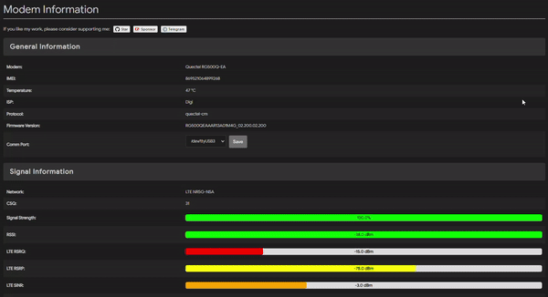

# luci-app-modeminfo

**luci-app-modeminfo** is a lightweight and powerful LuCI-based web interface for monitoring your modem's signal and network information. It provides detailed insights into your modem’s performance and connection status, such as signal strength, RSRP, RSRQ, SINR, and more, for both LTE and 5G networks. The app is designed to work within OpenWRT's LuCI framework.

> **Note:** Due to limited hardware access, this application was developed and tested on the **Quectel RG500Q-EA** modem. Other modems may not be fully supported.

## Features

- Real-time monitoring of modem information and network status
- Supports both 4G LTE and 5G NR signal metrics (CSQ, RSSI, RSRQ, RSRP, SINR)
- Displays general modem details such as IMEI, ISP, firmware version, and protocol
- Visual progress bars for signal strength and quality metrics
- Configurable refresh interval for real-time updates

## Preview

## Usage

Once the app is installed, you can monitor your modem's connection status and view signal quality metrics in real time. The app automatically refreshes the data based on your selected interval.

### Supported Metrics

- **Signal Strength (CSQ)**: Displays the signal strength as a percentage.
- **RSSI**: Received Signal Strength Indicator in dBm.
- **RSRQ**: LTE/NR5G Reference Signal Received Quality.
- **RSRP**: LTE/NR5G Reference Signal Received Power.
- **SINR**: LTE/NR5G Signal-to-Interference-plus-Noise Ratio.
- **MCC/MNC**: Mobile Country Code and Mobile Network Code.
- **Cell ID and PCI**: Provides cell identification and physical cell identifier.

## Credits

Special thanks to the following projects and developers for their inspiration and code contributions:

- [R00ter](https://github.com/ofmodemsandmen)
- [luci-app-3ginfo-lite](https://github.com/4IceG/luci-app-3ginfo-lite)

All ideas and inspiration for this app come from them.

## Support Me

If you enjoy using **luci-app-modeminfo** and want to support my work, please consider:

- Starring the project on GitHub: [GitHub Repo](https://github.com/solomonricky/luci-app-modeminfo)

  
  
- Buying me a coffee: [Buy Me a Coffee](https://buymeacoffee.com/solomonricky)

  
  
- Join the conversation on Telegram: [Telegram Channel](https://t.me/myopenwrt)

  

## License

**luci-app-modeminfo** is licensed under the GNU General Public License v3.0. See the [LICENSE](LICENSE) file for details.

